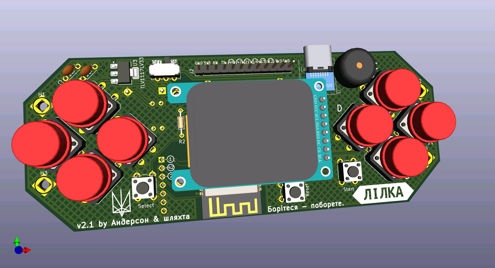

# Лілка

[][discord]

DIY-консоль, яку можна зібрати з дешевих готових модулів.

## Де її можна купити?

Всі посилання та інструкції доступні [ось тут](https://lilka.dev/shop/)!

## Демо

Новини про проєкт Лілка V2:

Перша версія Лілки:

## Документація

Повна документація проєкту буде доступна ось тут: <https://docs.lilka.dev>

## Спільнота

Приєднуйтесь до [нашого сервера в Discord][discord]!

## Я хочу допомогти писати код!

Ми будемо тільки раді! Є декілька варіантів:

- Хочете написати гру, програму, документацію чи щось таке? Звісно! Документація є [тут (C++)](https://docs.lilka.dev/uk/latest/keira/custom_apps/) і [тут (Lua)](https://docs.lilka.dev/uk/latest/keira/lua/intro/).
- Хочете допомогти з вдосконаленням коду? Виконайте команду `make todo` - вона відобразить всі TODO з коду, де потрібна допомога.
- Хочете допомогти ідейно? Знайшли баг або маєте ідею щодо покращення архітектури? Створіть новий тікет або пишіть в наш [Discord][discord] в форум `#лілка`.

[discord]: https://discord.gg/HU68TaKCu6
