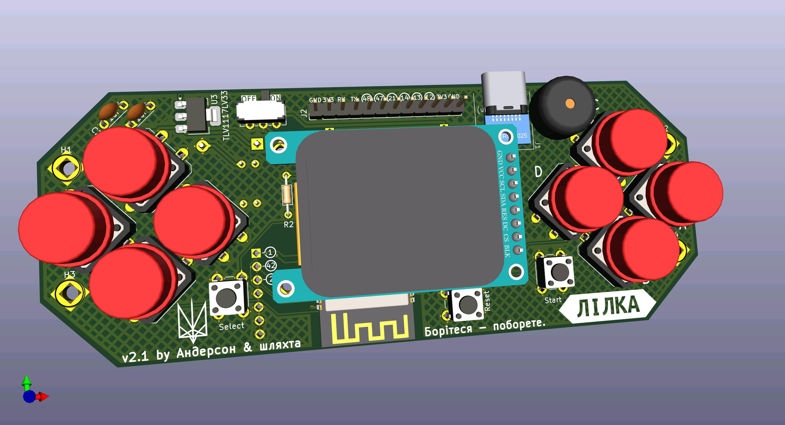

Що таке Лілка?
--------------

Лілка - це консоль на базі мікроконтролера ESP32-S3-WROOM-1-N16R8.

Її головна особливість - це те, що її можна легко зібрати з готових модулів, які продаються в магазинах.

Інший важливий фактор - це ціна: сумарна вартість всіх компонентів базового набору Лілки в Україні - близько 500-600 гривень.

Мета цього пристрою - це насамперед навчання. Зібравши її, в вас в руках опиниться проста, але повноцінна залізяка з купою цікавих можливостей:

- :ref:`Емулятор NES <sd-card-feature>`, який дозволить вам грати в нінтендівські ігри
- Можливість :ref:`запускати DOOM <sd-card-feature>` з непоганим FPS
- Вбудований WiFi- та Bluetooth-передавач
- :ref:`Роз'єм розширення <extension>` для під'єднання власних модулів
- :ref:`Підтримка Lua <lua-intro>` для легкого створення власних ігор та програм
- Можливість запуску програм з SD-карти

.. warning::

   Слід зауважити, що Лілка не позиціонується як ігрова консоль.

   Вона - це DIY-набір, який буде дуже легко зібрати навіть недосвідченим початківцям, і її мета - дати вам дешевий набір заліза, з яким можна погратись,
   а також готову бібліотеку взаємодії з дисплеєм, SD-картою, кнопками, звуком, батареєю та іншими компонентами.

   Звісно ж, ви зможете грати на ній в ігри! Але ігри - це не основне її призначення.
