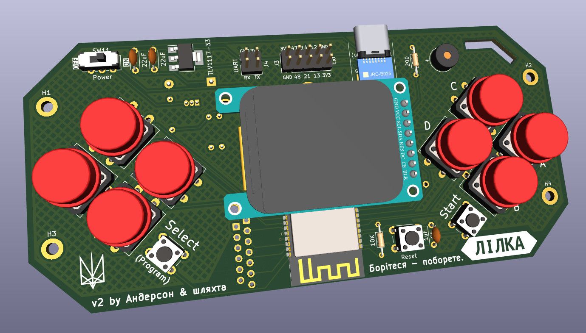

Що таке Лілка?
==============

TODO: написати опис

Лілка - це консоль на базі мікроконтролера ESP32-CS-WROOM-1-N16R8.

Її головна особливість - це те, що її можна легко зібрати з готових модулів, які продаються в магазинах.

Інший важливий фактор - це ціна: сумарна вартість всіх компонентів базового набору Лілки в Україні - близько 500-600 гривень.

Мета цього пристрою - це насамперед навчання. Зібравши її, в вас в руках опиниться проста, але повноцінна залізяка з купою цікавих можливостей:

- `Емулятор NES </manual/main_firmware.html>`_, який дозволить вам грати в нінтендівські ігри
- Можливість `запускати DOOM </manual/main_firmware.html>`_ з непоганим FPS
- Вбудований WiFi- та Bluetooth-передавач
- `Роз'єм розширення </manual/extension.html>`_ для під'єднання власних модулів
- `Підтримка Lua </manual/lua.html>`_ для легкого створення власних ігор та програм
- Можливість запуску програм з SD-карти

.. warning:: Слід зауважити, що Лілка не позиціонується як ігрова консоль. Вона - це DIY-набір, який буде дуже легко зібрати навіть недосвідченим початківцям, і її мета - дати вам дешевий набір заліза, з яким можна погратись, а також готову бібліотеку взаємодії з дисплеєм, SD-картою, кнопками, звуком, батареєю та іншими компонентами. Звісно ж, ви зможете грати на ній в ігри! Але ігри - це не основне її призначення.

