Що робить кожен компонент?
==========================

Якщо ви не знайомі з радіоелектронікою, вам, можливо, цікаво: навіщо потрібен кожен компонент Лілки?

Давайте розглянемо всі компоненти, з яких складається Лілка, і їхні основні функції.

Мікроконтролер ESP32-S3-WROOM-N16R8 (``U1``)
--------------------------------------------

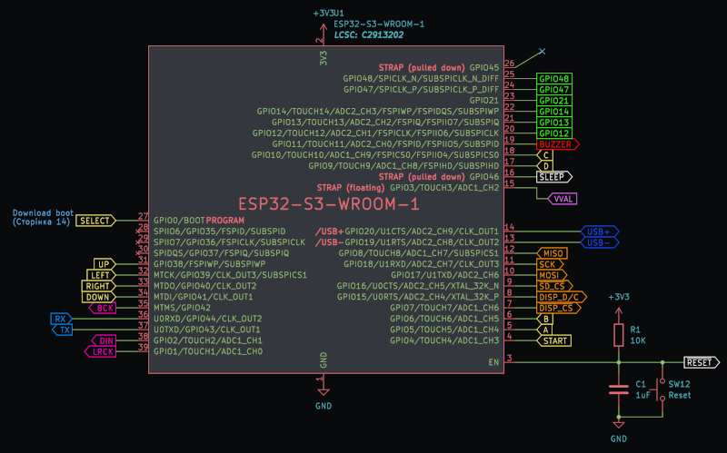

Мікроконтролер :ref:`ESP32-S3-WROOM-N16R8 <mcu>` від компанії Espressif - це мозок Лілки.

Він відповідає за управління всіма іншими компонентами, зчитування даних з датчиків, керування виводами, роботу з Wi-Fi і Bluetooth, і багато іншого.

Саме він місить флеш-пам'ять, в яку записується прошивка Лілки, і вбудовану пам'ять RAM.

Детальніше про мікроконтролер можна прочитати тут: :ref:`mcu`.

Конденсатор ``C1``, резистор ``R1`` та кнопка ``SW12`` ("Reset")
----------------------------------------------------------------

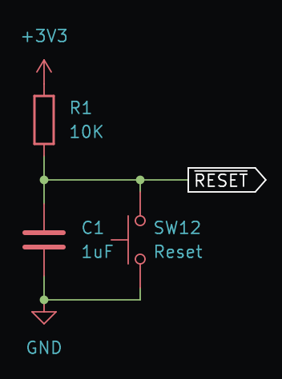

Ці компоненти відповідають за увімкнення мікроконтролера та його перезавантаження.

Річ у тім, що при під'єднанні живлення до Лілки, мікроконтролер не буде працювати коректно, доки не відбудеться процедура скидання (reset).

Уявіть собі, що сигнал скидання (reset) - це наче кава: коли на мікроконтролер подається живлення, він "прокидається" і починає спросоння робити неадекватні речі. Сигнал reset - це як кава: він "продупляє" мікроконтролер, і той починає працювати коректно.

Тобто скидання - це процес, який переводить мікроконтролер у початковий стан, в якому він може розпочати виконання програми з самого початку.

Резистор ``R1`` і конденсатор ``C1`` утворюють так зване RC-коло, або "коливальний контур", який відповідає за затримку сигналу скидання.
Це означає, що при підключенні живлення до Лілки, мікроконтролер розпочне роботу не відразу, а через деякий час (долю мікросекунди).

Цей коливальний контур є абсолютно необхідним і його потребують майже всі мікроконтролери: без нього мікроконтролер може працювати некоректно або взагалі не запускатися.

Регулятор напруги ``U3`` та конденсатори ``C2`` і ``C3``
--------------------------------------------------------

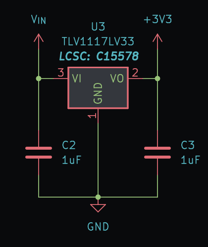

Ці компоненти відповідають за стабілізацію напруги живлення Лілки.

Мікроконтролер ESP32-S3-WROOM-N16R8 працює при напрузі від 3.0V до 3.6V. Але:

- Живлення від USB-порту комп'ютера може бути від 4.75V до 5.25V.
- Живлення від акумулятора може бути від 2.4V до 4.2V.

Обидві з цих напруг майже стовідсотково спалять мікроконтролер! Для цього і потрібен регулятор напруги ``U3``: він перетворює вхідну напругу в напругу 3.3V, яка потрібна мікроконтролеру.

Конденсатори ``C2`` і ``C3`` відповідають за стабілізацію напруги: вони зберігають енергію, яка потрібна компонентам Лілки, коли напруга від живлення змінюється.
Рекомендовані омінали цих конденсаторів переважно вказані в документації регулятора напруги.

Роз'єм USB (``J1``)
-------------------

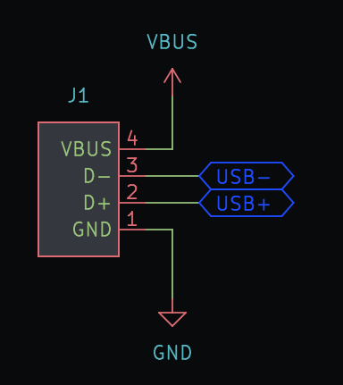

Модуль ``J1`` - це всього лиш плата з припаяним роз'ємом USB Type C. Вона не містить жодних інших компонентів - лише роз'єм.

Паяти роз'єм USB Type C безпосередньо на головну плату Лілки було б дуже складно: роз'єм має дуже маленькі контакти, які важко паяти.
Саме тому ми і використовуємо модуль ``J1``: він має великі контакти, які можна легко паяти на основну плату Лілки.

Модуль заряду-розряду LiPo-акумулятора (``J4``)
-----------------------------------------------

Якщо ви збираєте комплект Лілки з акумулятором, цей модуль відповідає за зарядку акумулятора від USB-порту, а також забезпечує захист від перезаряду та перерозряду акумулятора при роботі Лілки від акумулятора.

Він працює на основі мікросхеми ``TP4056``, тому його часто так і називають - "модуль TP4056".

На виході цей модуль дає напругу, яка дорівнює напрузі акумулятора, тобто від 2.4V до 4.2V. Ця напруга подається на регулятор напруги ``U3``, який перетворює її в 3.3V для живлення мікроконтролера.

Польовий транзистор P-типу ``Q1``, резистор ``R3`` та діод ``D1``
-----------------------------------------------------------------

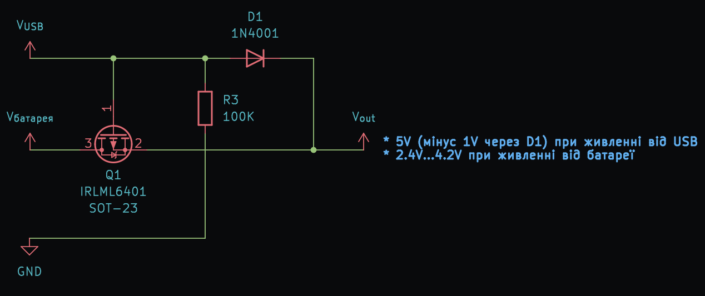

Ці компоненти потрібні для коректної роботи Лілки, коли ви одночасно заряджаєте акумулятор і живите Лілку від USB-порту.

Річ у тім, що одночасно заряджати акумулятор від USB і в той же час живити Лілку від цього ж акумулятора - небезпечно:
модуль TP4056 (``J4``) не вміє коректно відслідковувати стан заряду акумулятора, якщо той використовується Лілкою, і може подати на нього невідповідну напругу.

Тому ми використовуємо польовий транзистор P-типу (``Q1``), який "вимикається" при підключенні живлення від USB, і таким чином при під'єднаному USB-живленні Лілка живиться від USB, а не від акумулятора.

Резистор ``R3`` - це слабка підтяжка польового транзистора ``Q1`` до землі, щоб при відсутності напруги від USB цей транзистор не вимикався сам по собі, а за замовчуванням був увімкнений,
щоб Лілка живилася від акумулятора.

Діод ``D1`` - це захисний діод, який не дозволяє напрузі від акумулятора подаватися на USB-порт, коли USB-живлення під'єднане. Це потрібно, щоб не пошкодити USB-порт комп'ютера або зарядний пристрій.
Крім цього, як бонус - він частоково знижує напругу (на ~0.7V), і тому регулятор напруги ``U3`` при живленні Лілки від USB буде трохи менше нагріватися.

Резистори ``R2`` і ``R4``
-------------------------

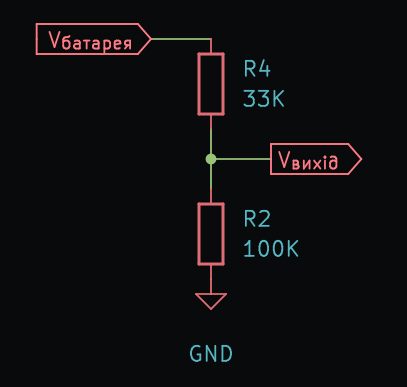

Ці резистори здійснюють ділення напруги для вимірювання напруги акумулятора.

Напруга акумулятора може бути в діапазоні від 2.4V до 4.2V, але :term:`АЦП` (аналого-цифровий перетворювач) мікроконтролера ESP32-S3-WROOM-N16R8 вміє вимірювати напругу лише від 0V до 3.1V.

Тому ми використовуємо резистори ``R2`` і ``R4``, які здійснюють ділення напруги, використовуючи формулу:

.. math::

    V_{\text{вихід}} = V_{\text{батарея}} \times \left(\frac{R_4}{R_2 + R_4}\right)

Номінали резисторів ``R2`` і ``R4`` вибираються так, щоб напруга на виході ділення була 3.1V при вхідній напрузі 4.2V.

В нашому випадку ми використовуємо резистори ``R2`` = 100 кОм і ``R4`` = 33 кОм.

Ми могли б використати і резистори менших номіналів - скажімо, 10 кОм і 3.3 кОм, але вони б витрачали в 100 разів більше енергії та швидше розряджали акумулятор.

Роз'єм розширення (``J2``)
--------------------------

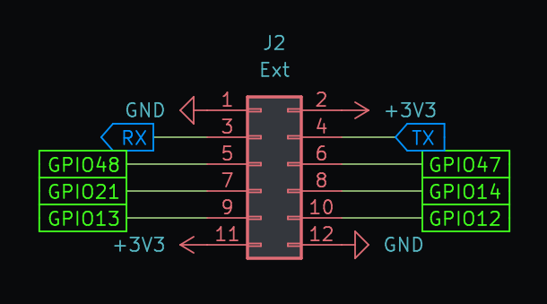

Лілка - це набір для розробки, і ви, можливо, захочете підключити до неї додаткові датчики, дисплеї, камери, акселеометри, сервоприводи чи ще щось.

Для цього і потрібен роз'єм розширення ``J2``: він має виводи для живлення сторонніх компонентів, а також декілька :term:`GPIO`-ліній мікроконтролера, які можна використовувати для підключення додаткових пристроїв.

Детальніше про роз'єм розширення можна прочитати в розділі :ref:`extension`.

Модуль SD-карти (``J3``)
------------------------

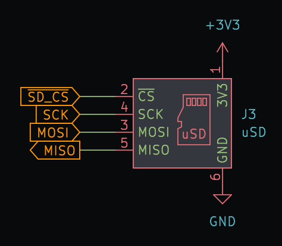

Цей модуль дозволяє Лілці читати та зберігати дані на SD-карті, а також запускати з неї сторонні прошивки.

SD-карти дозволяють працювати з ними через шину SPI, яка підтримується мікроконтролером ESP32-S3-WROOM-N16R8.

Більше інформації є тут: :ref:`sdcard`.

ЦАП (DAC) - Цифро-аналоговий перетворювач (``J5``)
--------------------------------------------------

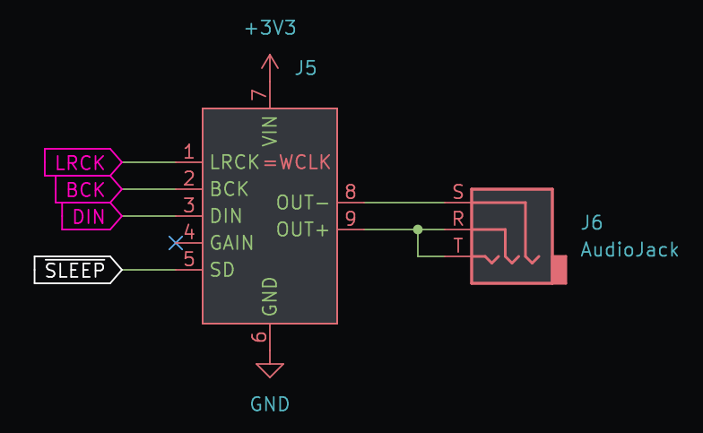

Цей компонент відповідає за генерацію аналогових сигналів.

Найпоширеніше використання ЦАП - генерація звуків: відтворення мелодій, голосів, звуків природи, і т.д.

Лілка використовує модуль ЦАП на базі мікросхеми ``MAX98357A`` від компанії Maxim Integrated.

Це дозволяє Лілці відтворювати звуки високої якості, а також підключати до неї аудіо-пристрої виведення звуку - наприклад, колонки, навушники, аудіо-підсилювачі тощо.

Для роботи з ЦАПом використовується шина I2S.

П'єзо-динамік (``BZ1``)
------------------------

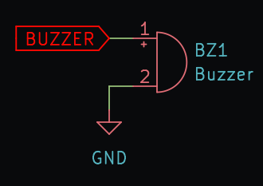

П'єзо-динамік - це простий динамік, який може відтворювати звуки. Його можна під'єднувати безпосередньо до :term:`GPIO`-виводів мікроконтролера.

Основні плюсі п'єзо-динаміка - його простота та ціна. Він не потребує жодних додаткових компонентів: просто підключіть його до :term:`GPIO`-виводів мікроконтролера і відтворюйте звуки.

Головний мінус - обмежені можливості. П'єзо-динамік може відтворювати лише прості звуки і не здатний відтворювати музику високої якості.
Крім того, ESP32-S3 не має вбудованого цифро-аналогового перетворювача, тому звукова хвиля може мати лише форму меандру (т. зв. "прямокутна" звукова хвиля).

Якщо ви хочете відтворювати музику високої якості, вам краще використати додатковий модуль ЦАП (див. вище).

IPS TFT дисплей (``U2``)
------------------------

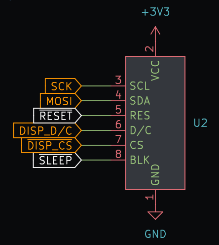

Дисплей. Куди ж без нього? ;)

Цей дисплей використовує IPS-матрицю, яка забезпечує високу якість зображення, широкі кути огляду, яскравість та насиченість кольорів.

Лілка використовує дисплей на базі мікросхеми ``ST7789`` від компанії Sitronix.

Кнопки
------

Думаю, тут все зрозуміло: кнопки використовуються для керування Лілкою.

Кожна кнопка підключена до свого :term:`GPIO`-виводу мікроконтролера і відповідає за певну функцію.

.. note::

    "Але чому ви не використали, скажімо, регістр зсуву для підключення кнопок, чи розширювачі I/O?" - запитаєте ви. "Ви могли б підключити до мікроконтролера 8 кнопок, використовуючи всього 3 :term:`GPIO`-виводи!"

    Відповідь проста: мета Лілки - бути простою у збірці. Регістри зсуву - це додаткові компоненти, які вам потрібно паяти і які займають місце на і так невеликій платі Лілки,
    тому ми вирішили обійтися без них.
