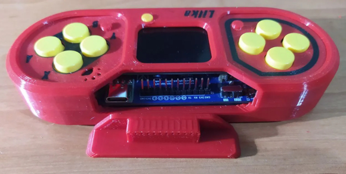
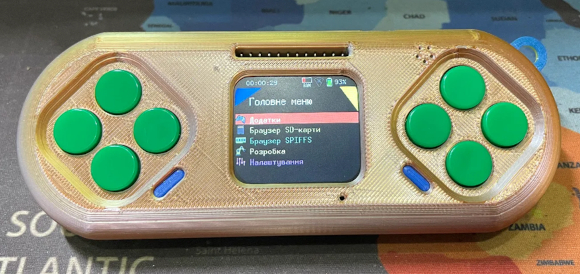
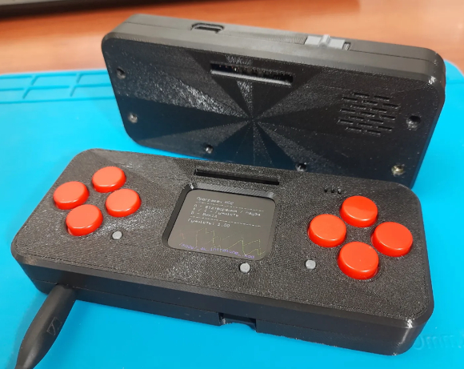
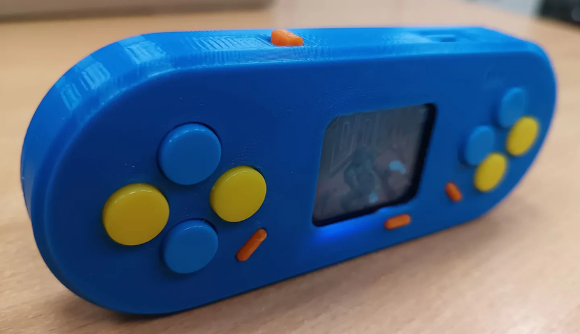

Моделі корпусів
===============

    .. warning:: 

        Уважно читайте інструкцію до кожної моделі, перш ніж розпочинати її друк! Кожен корпус має свої особливості та розрахований на різні моделі акумуляторів. 
        Також збірка плати для конкретного корпусу може дещо відрізнятися від тієї, що описана в документації.

**Корпус з кришечкою на пінах, для легкого доступу до них**  

   
Посилання:
https://www.printables.com/model/1173882-slim-case-for-lilka
  
  

**Мінімалістичний корпус без додаткових вставних частин**

Посилання:
https://www.printables.com/model/1120079-lilcase  
  

  

**Корпус в стилі "Quadratisch.Praktisch.Gut"**

Посилання:
https://www.printables.com/model/1181426-low-profile-case-for-lilka-dev-board

**Мінімалістичний корпус без заглиблень під кнопки**

Посилання:
https://www.printables.com/model/1189054-case-for-lilka-dev-board
