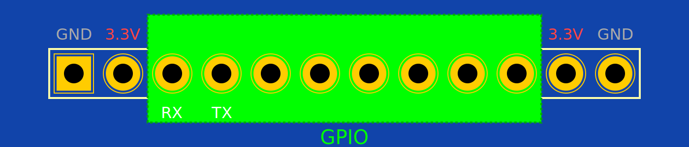

.. _extension:

Роз'єм розширення
=================

.. contents:: Зміст
    :local:
    :depth: 1

Загальна інформація
-------------------

Роз'єм розширення (англ. *extension header*) - це роз'єм, який дозволяє підключати до основної плати додаткові модулі, наприклад датчики, дисплеї, сервоприводи тощо.

Лілка має 12-контактний роз'єм розширення.

Ці піни можна використовувати для будь-якої цілі. Саме тому вони і називаються GPIO (General Purpose Input/Output) - вхід/вихід загального призначення.

На роз'єм розширення Лілки виведені наступні піни:

- ``3.3V`` - живлення 3.3 Вольти
- ``GND`` - земля
- ``12``, ``13``, ``14``, ``21``, ``47``, ``48`` - GPIO
- ``TX``, ``RX`` - додатковий UART. Ці піни можна використати для з'єднання Лілки з комп'ютером через перетворювач USB-UART та навіть прошивати її через цей порт. Але ви також можете без проблем використовувати ці піни для будь-яких інших цілей в додачу до перелічених вище пінів, а для прошивання використовувати USB-порт Лілки.

Вони не використовуються Лілкою для жодних внутрішніх потреб, тому ви можете використовувати їх для будь-яких цілей.

Завдяки вбудованому мультиплексору, кожен пін можна використовувати для шин I2C, SPI, UART, або просто як вхід/вихід.

Крім того, піни ``12``, ``13`` та ``14`` під'єднані до АЦП (аналого-цифрового перетворювача, ADC):

- ``12`` - ADC2, канал 1
- ``13`` - ADC2, канал 2
- ``14`` - ADC2, канал 3

Приклад використання GPIO
-------------------------

Найпростіший приклад використання GPIO - це підключити до роз'єму розширення світлодіод та резистор, щоб світлодіод світився, коли на пін подаватиметься напруга.

Наприклад, пін ``12`` можна підключити до анода світлодіода (довший вивід), а катод світлодіода (коротший вивід) - через резистор до землі (наприклад, 100 Ом).

Обчислити значення резистора для світлодіода можна за `цим посиланням <https://www.digikey.com/en/resources/conversion-calculators/conversion-calculator-led-series-resistor>`_.

Після цього можна використати наступний код для того, щоб світлодіод блимав:

.. code-block:: cpp

    #include <lilka.h>

    void setup() {
        lilka::begin();
    }

    void loop() {
        digitalWrite(12, HIGH);
        delay(500);
        digitalWrite(12, LOW);
        delay(5000);
    }

Використання GPIO для шини I2C
------------------------------

Щоб використати піни розширення для шини I2C, використайте наступний код:

.. code-block:: cpp

    #include <lilka.h>
    #include <Wire.h>

    #define SDA_PIN 13
    #define SCL_PIN 14

    void setup() {
        lilka::begin();
        Wire.begin(SDA_PIN, SCL_PIN);
    }

    void loop() {
        // Почати передачу на адресу 0x42
        Wire.beginTransmission(0x42);
        // Надіслати байт 66
        Wire.write(0x42);
        // Завершити передачу
        Wire.endTransmission();
        delay(1000);
    }

Використання GPIO для шини SPI
------------------------------

Щоб використати піни розширення для шини SPI, використайте наступний код:

.. code-block:: cpp

    #include <lilka.h>

    #define SCK_PIN 12
    #define MISO_PIN 13
    #define MOSI_PIN 14
    #define SS_PIN 21

    void setup() {
        lilka::begin();

        // Ми використовуємо SPI2, тому що SPI1 використовується для внутрішніх потреб Лілки (для дисплея та SD-картки)
        lilka::SPI2.begin(SCK_PIN, MISO_PIN, MOSI_PIN, SS_PIN);
    }

    void loop() {
        // Починаємо транзакцію: швидкість - 1 МГц, порядок байтів - MSB, режим SPI - 0
        lilka::SPI2.beginTransaction(SPISettings(1000000, MSBFIRST, SPI_MODE0));
        // Активуємо пристрій
        digitalWrite(SS_PIN, LOW);
        // Надсилаємо байт 66
        lilka::SPI2.transfer(0x42);
        // Деактивуємо пристрій
        digitalWrite(SS_PIN, HIGH);
        // Завершуємо транзакцію
        lilka::SPI2.endTransaction();
        delay(1000);
    }
